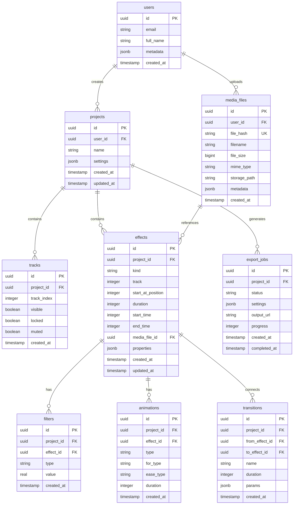

# Data Model: ProEdit MVP

**Feature**: ProEdit MVP - Browser-Based Video Editor
**Date**: 2025-10-14
**Based on**: omniclip implementation patterns

## Overview

The data model follows a polymorphic design pattern for effects, enabling extensibility while maintaining type safety. All tables implement Row Level Security (RLS) for multi-tenant isolation.

## Entity Relationship Diagram



## Entity Definitions

### 1. Projects

**Purpose**: Core container for all editing work

**Fields**:
| Field | Type | Constraints | Description |
|-------|------|-------------|-------------|
| id | UUID | PRIMARY KEY | Auto-generated unique identifier |
| user_id | UUID | FOREIGN KEY, NOT NULL | Owner of the project |
| name | TEXT | NOT NULL | User-defined project name |
| settings | JSONB | DEFAULT | Project configuration |
| created_at | TIMESTAMPTZ | DEFAULT NOW() | Creation timestamp |
| updated_at | TIMESTAMPTZ | DEFAULT NOW() | Last modification timestamp |

**Settings JSON Structure**:
```json
{
  "width": 1920,
  "height": 1080,
  "fps": 30,
  "aspectRatio": "16:9",
  "bitrate": 9000,
  "standard": "1080p"
}
```

**Validation Rules**:
- Name must be 1-255 characters
- Settings must include width, height, fps
- User must be authenticated

**State Transitions**: None (CRUD only)

### 2. Media Files

**Purpose**: Centralized storage for all uploaded assets with deduplication

**Fields**:
| Field | Type | Constraints | Description |
|-------|------|-------------|-------------|
| id | UUID | PRIMARY KEY | Unique identifier |
| user_id | UUID | FOREIGN KEY, NOT NULL | Uploader |
| file_hash | TEXT | UNIQUE, NOT NULL | SHA-256 for deduplication |
| filename | TEXT | NOT NULL | Original filename |
| file_size | BIGINT | NOT NULL | Size in bytes |
| mime_type | TEXT | NOT NULL | MIME type |
| storage_path | TEXT | NOT NULL | Supabase Storage path |
| metadata | JSONB | DEFAULT {} | File-specific metadata |
| created_at | TIMESTAMPTZ | DEFAULT NOW() | Upload timestamp |

**Metadata Structure (Video)**:
```json
{
  "duration": 5000,
  "fps": 30,
  "frames": 150,
  "width": 1920,
  "height": 1080,
  "codec": "h264",
  "thumbnail": "base64_string"
}
```

**Validation Rules**:
- File size ≤ 500MB
- Supported MIME types only
- Hash must be unique per user

### 3. Effects (Polymorphic)

**Purpose**: Represents any element on the timeline (video, audio, image, text)

**Fields**:
| Field | Type | Constraints | Description |
|-------|------|-------------|-------------|
| id | UUID | PRIMARY KEY | Unique identifier |
| project_id | UUID | FOREIGN KEY, NOT NULL | Parent project |
| kind | TEXT | CHECK IN (...) | Effect type |
| track | INTEGER | NOT NULL | Track number (0-based) |
| start_at_position | INTEGER | NOT NULL | Timeline position (ms) |
| duration | INTEGER | NOT NULL | Display duration (ms) |
| start_time | INTEGER | NOT NULL | Trim start (ms) |
| end_time | INTEGER | NOT NULL | Trim end (ms) |
| media_file_id | UUID | FOREIGN KEY | Reference to media (optional for text) |
| properties | JSONB | NOT NULL | Type-specific properties |
| created_at | TIMESTAMPTZ | DEFAULT NOW() | Creation timestamp |
| updated_at | TIMESTAMPTZ | DEFAULT NOW() | Last modification |

**Kind Values**: `'video'`, `'audio'`, `'image'`, `'text'`

**Properties by Kind**:

**Video/Image Properties**:
```json
{
  "rect": {
    "width": 1920,
    "height": 1080,
    "scaleX": 1.0,
    "scaleY": 1.0,
    "position_on_canvas": {"x": 960, "y": 540},
    "rotation": 0,
    "pivot": {"x": 960, "y": 540}
  },
  "raw_duration": 5000,
  "frames": 150
}
```

**Text Properties**:
```json
{
  "text": "Sample Text",
  "fontFamily": "Arial",
  "fontSize": 48,
  "fontStyle": "normal",
  "align": "center",
  "fill": ["#FFFFFF"],
  "rect": {
    "width": 500,
    "height": 100,
    "position_on_canvas": {"x": 960, "y": 540}
  },
  "stroke": "#000000",
  "strokeThickness": 2,
  "dropShadow": true,
  "dropShadowDistance": 5,
  "dropShadowBlur": 3,
  "dropShadowAlpha": 0.5,
  "dropShadowAngle": 45,
  "dropShadowColor": "#000000"
}
```

**Validation Rules**:
- No overlapping effects on same track
- Duration > 0
- Position ≥ 0
- Valid kind value

### 4. Tracks

**Purpose**: Horizontal layers in the timeline

**Fields**:
| Field | Type | Constraints | Description |
|-------|------|-------------|-------------|
| id | UUID | PRIMARY KEY | Unique identifier |
| project_id | UUID | FOREIGN KEY, NOT NULL | Parent project |
| track_index | INTEGER | NOT NULL | Order (0 = bottom) |
| visible | BOOLEAN | DEFAULT true | Visibility toggle |
| locked | BOOLEAN | DEFAULT false | Edit lock |
| muted | BOOLEAN | DEFAULT false | Audio mute |
| created_at | TIMESTAMPTZ | DEFAULT NOW() | Creation timestamp |

**Validation Rules**:
- Unique track_index per project
- Track_index ≥ 0

### 5. Filters

**Purpose**: Visual effects applied to media elements

**Fields**:
| Field | Type | Constraints | Description |
|-------|------|-------------|-------------|
| id | UUID | PRIMARY KEY | Unique identifier |
| project_id | UUID | FOREIGN KEY, NOT NULL | Parent project |
| effect_id | UUID | FOREIGN KEY, NOT NULL | Target effect |
| type | TEXT | NOT NULL | Filter type |
| value | REAL | NOT NULL | Filter intensity |
| created_at | TIMESTAMPTZ | DEFAULT NOW() | Creation timestamp |

**Filter Types**: `'brightness'`, `'contrast'`, `'saturation'`, `'blur'`, `'hue'`

### 6. Animations

**Purpose**: Entrance/exit animations for effects

**Fields**:
| Field | Type | Constraints | Description |
|-------|------|-------------|-------------|
| id | UUID | PRIMARY KEY | Unique identifier |
| project_id | UUID | FOREIGN KEY, NOT NULL | Parent project |
| effect_id | UUID | FOREIGN KEY, NOT NULL | Target effect |
| type | TEXT | CHECK IN ('in','out') | Animation direction |
| for_type | TEXT | NOT NULL | Target property |
| ease_type | TEXT | NOT NULL | Easing function |
| duration | INTEGER | NOT NULL | Animation duration (ms) |
| created_at | TIMESTAMPTZ | DEFAULT NOW() | Creation timestamp |

### 7. Transitions

**Purpose**: Visual transitions between effects

**Fields**:
| Field | Type | Constraints | Description |
|-------|------|-------------|-------------|
| id | UUID | PRIMARY KEY | Unique identifier |
| project_id | UUID | FOREIGN KEY, NOT NULL | Parent project |
| from_effect_id | UUID | FOREIGN KEY | Source effect |
| to_effect_id | UUID | FOREIGN KEY | Target effect |
| name | TEXT | NOT NULL | Transition type |
| duration | INTEGER | NOT NULL | Transition duration (ms) |
| params | JSONB | DEFAULT {} | Transition parameters |
| created_at | TIMESTAMPTZ | DEFAULT NOW() | Creation timestamp |

### 8. Export Jobs

**Purpose**: Track video export tasks

**Fields**:
| Field | Type | Constraints | Description |
|-------|------|-------------|-------------|
| id | UUID | PRIMARY KEY | Unique identifier |
| project_id | UUID | FOREIGN KEY, NOT NULL | Source project |
| status | TEXT | CHECK IN (...) | Job status |
| settings | JSONB | NOT NULL | Export configuration |
| output_url | TEXT | | Download URL when complete |
| progress | INTEGER | DEFAULT 0 | Progress percentage |
| created_at | TIMESTAMPTZ | DEFAULT NOW() | Start time |
| completed_at | TIMESTAMPTZ | | Completion time |

**Status Values**: `'pending'`, `'processing'`, `'completed'`, `'failed'`, `'cancelled'`

## Indexes

```sql
-- Performance indexes
CREATE INDEX idx_projects_user_id ON projects(user_id);
CREATE INDEX idx_projects_updated_at ON projects(updated_at DESC);
CREATE INDEX idx_media_files_user_id ON media_files(user_id);
CREATE INDEX idx_media_files_hash ON media_files(file_hash);
CREATE INDEX idx_effects_project_id ON effects(project_id);
CREATE INDEX idx_effects_track ON effects(project_id, track);
CREATE INDEX idx_effects_timeline ON effects(project_id, start_at_position);
CREATE INDEX idx_tracks_project_id ON tracks(project_id, track_index);
CREATE INDEX idx_filters_effect_id ON filters(effect_id);
CREATE INDEX idx_animations_effect_id ON animations(effect_id);
CREATE INDEX idx_transitions_effects ON transitions(from_effect_id, to_effect_id);
CREATE INDEX idx_export_jobs_project ON export_jobs(project_id, status);
```

## Row Level Security (RLS) Policies

### Projects
```sql
-- Users can only see their own projects
CREATE POLICY "Users can view own projects"
  ON projects FOR SELECT
  USING (auth.uid() = user_id);

-- Users can only create their own projects
CREATE POLICY "Users can create own projects"
  ON projects FOR INSERT
  WITH CHECK (auth.uid() = user_id);

-- Users can only update their own projects
CREATE POLICY "Users can update own projects"
  ON projects FOR UPDATE
  USING (auth.uid() = user_id);

-- Users can only delete their own projects
CREATE POLICY "Users can delete own projects"
  ON projects FOR DELETE
  USING (auth.uid() = user_id);
```

### Media Files
```sql
-- Users can only see their own media files
CREATE POLICY "Users can view own media"
  ON media_files FOR SELECT
  USING (auth.uid() = user_id);

-- Users can only upload their own media
CREATE POLICY "Users can upload media"
  ON media_files FOR INSERT
  WITH CHECK (auth.uid() = user_id);
```

### Effects (and related tables)
```sql
-- Users can manage effects in their own projects
CREATE POLICY "Users can manage effects in own projects"
  ON effects
  USING (EXISTS (
    SELECT 1 FROM projects
    WHERE projects.id = effects.project_id
    AND projects.user_id = auth.uid()
  ));
```

## Storage Structure

```
media-files/                  # Supabase Storage bucket
├── {user_id}/
│   ├── {file_hash}.mp4      # Video files
│   ├── {file_hash}.mp3      # Audio files
│   ├── {file_hash}.jpg      # Images
│   └── thumbnails/
│       └── {file_hash}.jpg  # Video thumbnails
```

## Migration Order

1. Enable UUID extension
2. Create users table (handled by Supabase Auth)
3. Create projects table
4. Create media_files table
5. Create tracks table
6. Create effects table
7. Create filters table
8. Create animations table
9. Create transitions table
10. Create export_jobs table
11. Create all indexes
12. Enable RLS on all tables
13. Create RLS policies

## Type Generation

Use Supabase CLI to generate TypeScript types:

```bash
npx supabase gen types typescript --project-id [project-id] > types/supabase.ts
```

## Data Integrity Rules

1. **Cascading Deletes**: Deleting a project removes all associated data
2. **Deduplication**: Same file hash reuses existing media_files entry
3. **Timeline Consistency**: No overlapping effects on same track
4. **Orphan Prevention**: Scheduled cleanup of unreferenced media files
5. **Audit Trail**: updated_at triggers on all modification